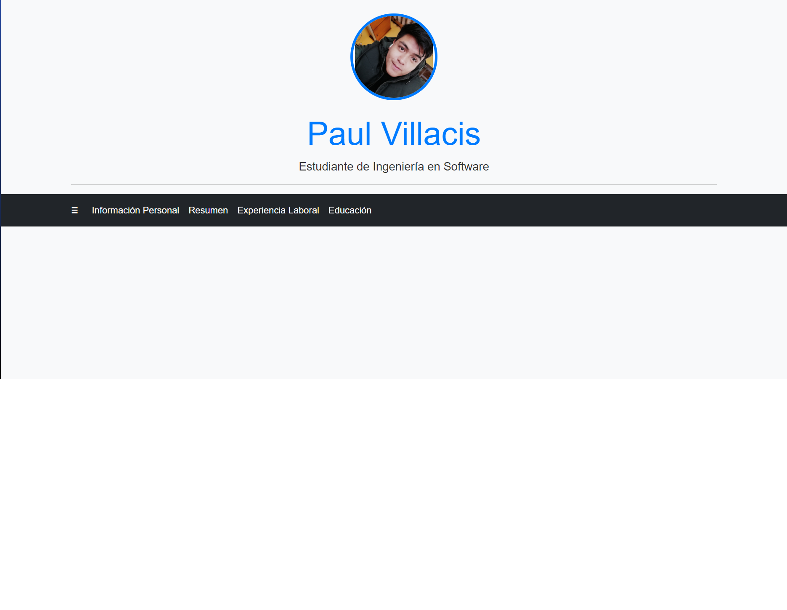
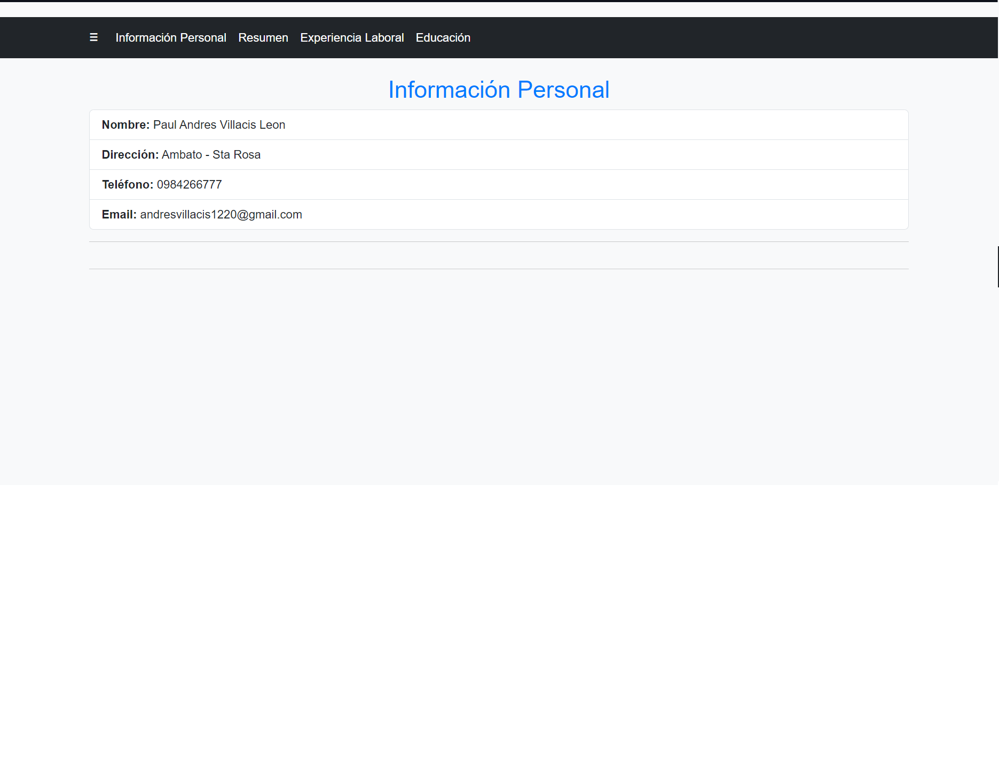
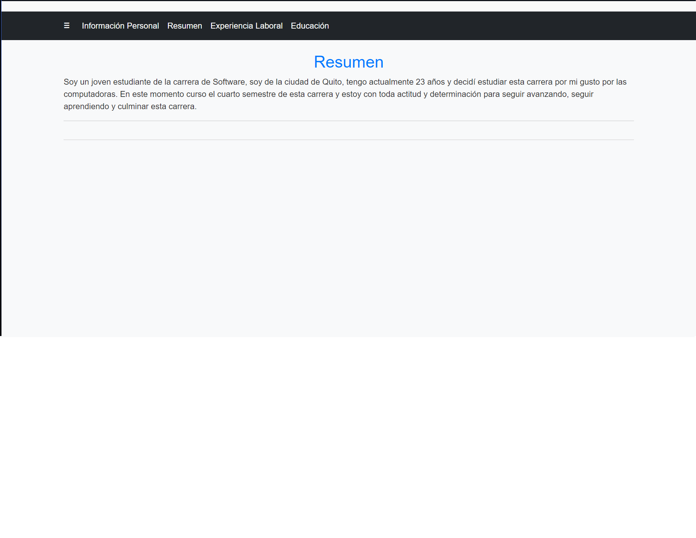
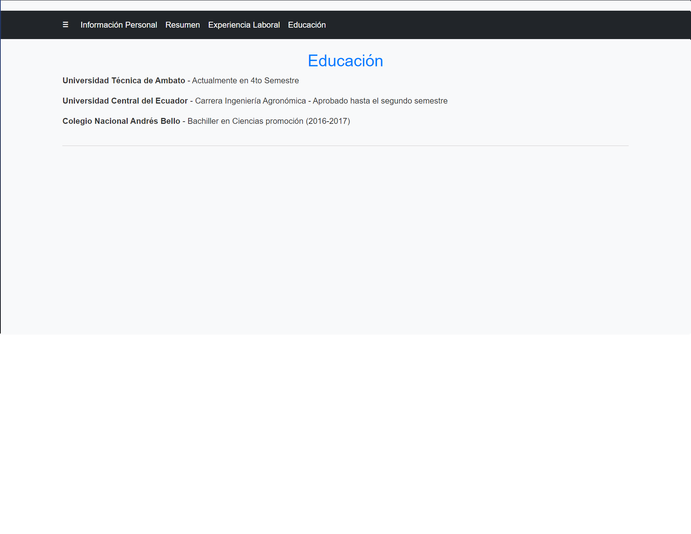

# Título del Proyecto
PAGINA WEB CON MI INFORMACION PERSONAL
## Descripcion
Esta pagina esta realizada para dar a conocer un poco sobre mi
## Capturas de pantalla

        
        
        
        

## Instrucciones de Uso

1. *Clonar el Repositorio:*
   ```bash
   git clone https://github.com/Villa1220/Villa1220.github.io.git
2. *Abrir el Archivo HTML:*
   Abre el archivo `index.html` en tu navegador web para visualizar el portafolio.

3. *Modifica el contenido:*
   Eres libre de modificar el contenido y poner toda tu informacion.


<h3 align="left">Construido con 🛠️</h3>
<p align="left"> <a href="https://getbootstrap.com" target="_blank" rel="noreferrer">  </a> <a href="https://www.w3schools.com/css/" target="_blank" rel="noreferrer">  </a> <a href="https://git-scm.com/" target="_blank" rel="noreferrer">  </a> <a href="https://www.w3.org/html/" target="_blank" rel="noreferrer">  </a> <a </p>

## Autores ✒️
* **Paul Villacis** - *Trabajo Inicial & Documentación* - [Villa1220](https://github.com/Villa1220)

